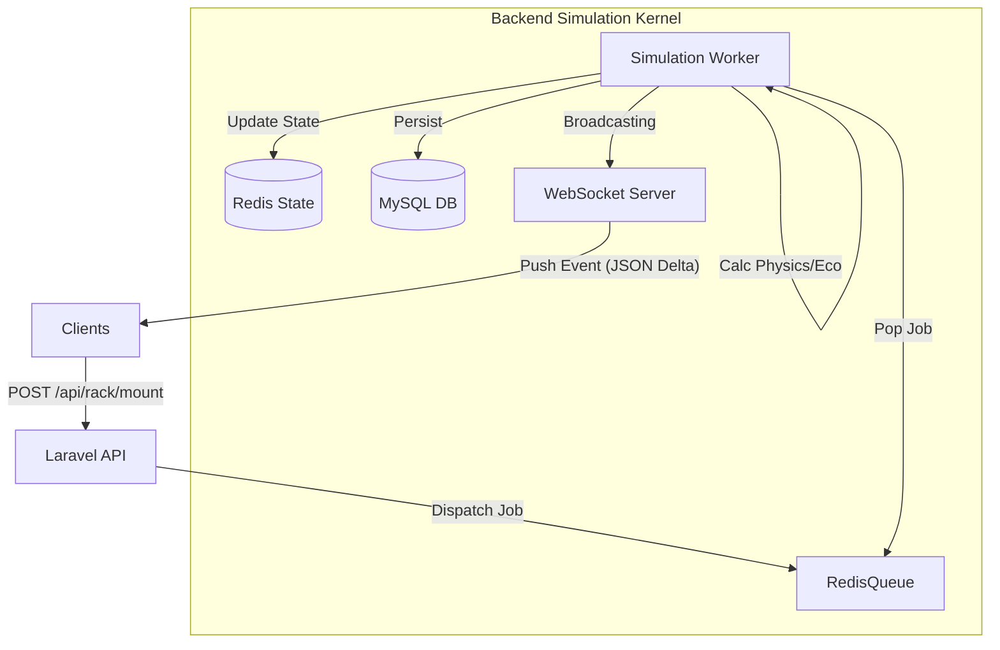

# Rackora Web V2 – Systems Architecture Strategy

**Version:** 2.0.0-DRAFT
**Target:** Scalable Enterprise-Grade Simulation Platform
**Design Philosophy:** Server-Authoritative, Event-Driven, "System-First"

---

## 1️⃣ Web-Architektur-Plan

### Systemstruktur & Layering

Die Architektur folgt einem **Strict Separation of Concerns** Modell. Der Client ist eine reine "View", die State empfängt und Commands sendet. Die Logik liegt zu 100% im Backend.

#### A. Backend Ecosystem (The "Core")
1.  **Command Layer (API Gateway / Controllers)**
    *   Nimmt User-Aktionen entgegen (z.B. `MountServer`, `AdjustCooling`).
    *   Validiert Input & Rechte (Policies).
    *   Dispatched **Jobs** auf den Event Bus.
    *   **Response:** Nur `202 Accepted` oder `200 OK` (Ack), keine Berechnungen.

2.  **Simulation Layer (Async Workers)**
    *   Läuft im Hintergrund (Laravel Horizon / Redis Queues).
    *   Verarbeitet die Business Logic *atomar*.
    *   **Tick Engine:** Ein Cron/Daemon, der jede Minute oder Sekunde "World Ticks" feuert.
    *   Berechnet Heat, Power, Economy delta.

3.  **State Layer (Redis Hot Store)**
    *   Hält den *aktuellen* Zustand aller aktiven Räume/Racks im RAM.
    *   **Grund:** MySQL ist zu langsam für 10k Spieler mit Echtzeit-Heat-Updates.
    *   Write-Through Cache: Änderungen gehen in Redis UND die DB.

4.  **Distribution Layer (WebSockets / Reverb)**
    *   Pusht **State Deltas** an Clients.
    *   Channels: `room.{id}`, `player.{id}`, `global.events`.

#### B. Frontend Ecosystem (The "View")
1.  **Sync Layer (Pinia Stores)**
    *   Empfängt WS-Events (`RackUpdated`, `TemperatureSpike`).
    *   Merged Deltas in den lokalen State (`patch`).
    *   Führt **Optimistic Updates** durch (UI zeigt Aktion sofort an, rollt zurück bei Fehler).

2.  **Render Layer (Vue 3)**
    *   **Dumb Components:** Rendern nur Props. Keine Logik.
    *   **Smart Containers:** Verbinden Stores mit Components.

#### Datenfluss-Diagramm

#### Event Lifecycle (Eskalations-Beispiel)

1.  **Trigger:** Tick Worker stellt fest: `Rack 42 PowerDraw > MaxCapacity`.
2.  **Event Generation:** Erzeugt internes Event `PowerOverload { rack_id: 42, severity: 'critical' }`.
3.  **Propagation:**
    *   System berechnet `FailureChance` (+10% pro Tick).
    *   Event `RackStateChanged` wird an Redis Pub/Sub gesendet.
4.  **Client Reaction:** 
    *   Client empfängt Event.
    *   Rack blinkt rot.
    *   Sound-Engine spielt "VoltageHum_Heavy.mp3".
5.  **Resolution:** Wenn Spieler nicht handelt -> `ComponentFailure` Job wird dispatcht -> Hardware geht permanent kaputt (Status: `dead`).

---

## 2️⃣ UI-Refactor-Strategie (Enterprise Grade)

**Design-Ziel:** "NASA Mission Control" meets "Vercel Dashboard".

#### Layout-Architektur (The "Tri-Pane" System)

1.  **Level 1: Global Context (Linke Sidebar - Collapsed by default)**
    *   Nur Icons. Tooltips bei Hover.
    *   Global Notifications Badges.
    *   Navigation zwischen: *Operations (Racks)*, *Strategy (Map)*, *Finance*, *Admin*.
    *   **Regel:** Nimmt max. 60px Breite ein.

2.  **Level 2: The Workspace (Main Canvas)**
    *   Hier passiert die Arbeit.
    *   Kein unnötiges Padding.
    *   Visualisierung der Daten oder physischen Objekte (Racks).
    *   **Sticky Topbar:** Zeigt nur Kontext-relevante Infos (aktueller Raum, Gesamstromverbrauch, Kapital).

3.  **Level 3: Inspection & Action (Rechte Sidebar - "The Inspector")**
    *   Context-sensitiv. Klickst du ein Rack, zeigts Rack-Details. Klickst du Server, Server-Details.
    *   Hier sind die **Action Buttons** (Kaufen, Reparieren, Config).
    *   **Regel:** Action-Buttons sind immer unten fixiert ("Action Footer").

#### Visuelles Regelwerk

*   **Color as Meaning:**
    *   Graustufen für Struktur (Surface 0-900).
    *   Farbe *nur* für Status.
    *   🟢 `OK` (sehr gedämpft, fast grau-grün)
    *   🟡 `Warning` (helles Bernstein)
    *   🔴 `Critical` (leuchtendes Neon-Rot + Schein nach außen)
    *   🔵 `Action` (UI Interaktion / Fokus)
*   **Typografie:**
    *   Verwendung einer Monospace-Schrift (z.B. JetBrains Mono oder DM Mono) für *alle* Zahlen und IDs.
    *   Sans-Serif (Inter) für Labels und Texte.
*   **Spacing:**
    *   Grid-basiert (4px / 8px).
    *   "Dense"-Mode als Standard. Enterprise-Software verschwendet keinen Platz.

---

## 3️⃣ Performance-Optimierungsplan

#### Backend (High-Density Simulation)

1.  **State Normalization:**
    *   Datenbank speichert Racks nicht als JSON blobos, sondern relational, ABER:
    *   Redis speichert "Flat Maps" für schnellen Zugriff: `rack:42:slots` -> Bitmask oder Byte-Array statt JSON Objekten (wenn möglich).
2.  **Async Processing & Rate Limiting:**
    *   User kann nicht spammen. API wirft `429 Too Many Requests` wenn > 5 Actions/Sek.
    *   Batch-Processing für Ticks: Ein Worker-Prozess berechnet 100 Räume auf einmal (Bulk Update), statt 100 einzelne Jobs.

#### Frontend (60 FPS Goal)

1.  **Delta Sync:**
    *   Niemals `reloadAll()`.
    *   Das Backend sendet nur: `{ "rack_id": 105, "temp": 45.2 }`.
    *   Frontend updated nur diesen einen Wert im Store.
2.  **Render Isolation (Vue):**
    *   Jedes Rack im Grid ist eine eigene Komponente mit `v-memo="[rack.hash]"`.
    *   Vue rendert das DOM für das Rack *nur* neu, wenn sich der Hash (berechnet aus Status, Temp, Power) ändert.
3.  **WebGL Layer (Optional for V2.5):**
    *   Wenn mehr als 50 Racks gleichzeitig sichtbar sind -> Switch von DOM-Nodes zu Canvas/WebGL (PixiJS oder Three.js Plane).

#### Monitoring & Health

*   **KPIs im Admin-Panel:**
    *   `Tick_Duration_ms`: Wie lange dauert die Berechnung eines World-Ticks?
    *   `Event_Lag_ms`: Zeit zwischen Occurrence und Client-Empfang.
    *   `Redis_Memory_Usage`.

---

## 4️⃣ Rack-System V2 Konzept (Strategic Core)

Das Rack ist nicht mehr nur ein Container, sondern ein **Thermodynamisches System**.

#### Das U-Grid & Physics

*   **Höhe:** Standard 42 HE (Höheneinheiten).
*   **Zonen:** Top, Middle, Bottom.
    *   *Bottom:* Kälteste Zone (Ansaugung). Beste Effizienz für High-Performance Nodes.
    *   *Top:* Wärmste Zone (Heat Rises Logic). Risiko für Überhitzung höher.

#### Drag & Drop Gameplay

*   **Snap-Logic:** Server "snappen" magnetisch an freie HEs.
*   **Collision:** Rote "Ghost"-Überlagerung, wenn Slot belegt oder Server zu groß.
*   **Live Preview:**
    *   Während du einen Server "hältst" (drag), zeigt das Ziel-Rack bereits:
        *   Projizierten neuen Stromverbrauch (+800W) als *Geister-Balken*.
        *   Projizierte Hitzeentwicklung.

#### Simulation Formeln (Vereinfacht)

1.  **Rack Temperature (`T_rack`):**
    `T_rack = T_ambient + (Sum(Server_Watts) * Efficiency_Factor) / Cooling_Airflow`
2.  **Server Temperature (`T_cpu`):**
    `T_cpu = T_rack_local + (CPU_Load * Thermal_Resistance)`
    *   `T_rack_local` ist höher, wenn Server im oberen Drittel hängt (+2°C Penalty).
3.  **Power Cascade:**
    *   Wenn `Current_Power > Rated_Power` für > 10 Sekunden -> **Fuse Blow Event**.
    *   Rack geht offline. Alle Server `status: 'unreachable'`.
    *   Spieler muss "Sicherung tauschen" (Action im Inspector) + Strafe zahlen.

#### Visual Feedback States

1.  **Normal:** Dünne, graue Umrandung. Grüne Status-LEDs.
2.  **Warning (Temp > 40°C):** Gelber Schein am oberen Rand. Lüfter-Animation schneller.
3.  **Critical (Temp > 50°C):** Pulsierender roter Rand. Partikel-Effekt (kleine Hitzewellen/Verzerrung über dem Rack via CSS Filter).
4.  **Failure:** Ausgegraut, "NO SIGNAL" Icon overlay.

---

### Implementation Roadmap

1.  **Phase 1:** Backend Refactor. Migration auf Command-Pattern Controller und Redis State Store.
2.  **Phase 2:** WebSocket "Tick" Engine implementieren für Live-Updates ohne Polling.
3.  **Phase 3:** Frontend UI Refactor (Layouts & Components) gemäß neuem Design-System.
4.  **Phase 4:** Rack V2 Logik (Drag&Drop, Physics, Heatmap) implementieren.
